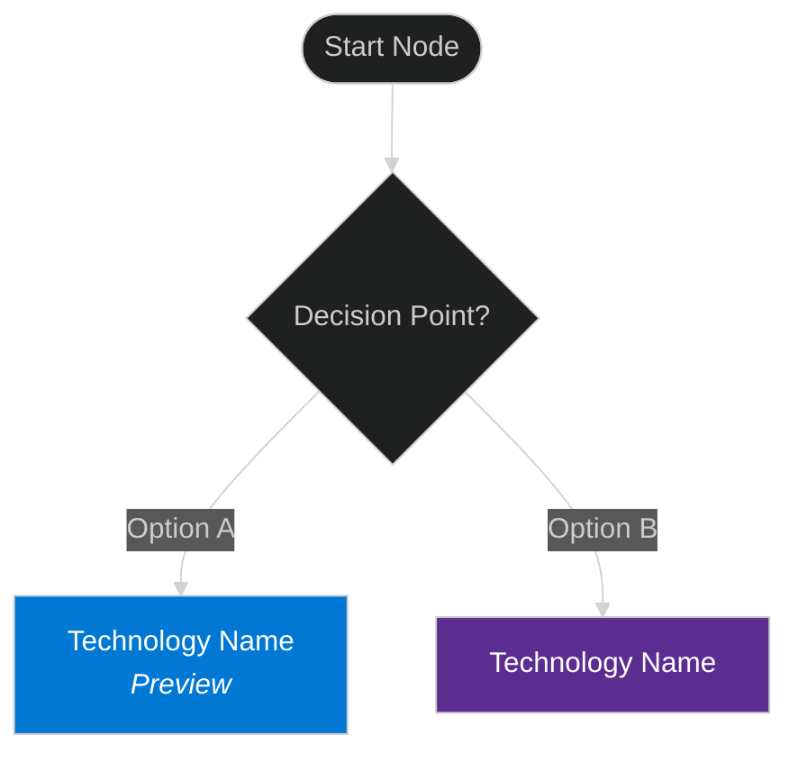

# Microsoft AI Decision Tree - Copilot Instructions

## Project Overview

This is a **comprehensive decision framework and reference guide** for navigating Microsoft's AI technology portfolio. The project helps users systematically evaluate and select the right Microsoft AI technology (M365 Copilot, Copilot Studio, Azure AI Foundry, Agent Service, SDKs, etc.) for their specific business requirements.

**Primary Goal:** Enable evidence-based technology selection through a structured learning journey that progresses from foundational concepts to technical mastery.

**Target Audience:** Technical decision-makers, architects, developers, and business stakeholders evaluating Microsoft AI technologies for enterprise use cases.

---

## Technology Stack

- **Static Site Generator:** Jekyll 4.4+ (GitHub Pages)
- **Documentation Format:** Markdown (.md files)
- **Diagrams:** Mermaid 11.12.1 flowcharts (embedded in Markdown, dark theme configured)
- **Navigation:** Jekyll front matter with `nav_order` property (1-12)
- **Theme:** Just the Docs (remote_theme via GitHub Pages)
- **Custom Styling:** SCSS in `_sass/custom/custom.scss` with aggressive space optimization
- **Ruby Gems:** jekyll-seo-tag, jekyll-github-metadata, jekyll-include-cache, webrick
- **Deployment:** GitHub Pages at https://chrismckee1.github.io/microsoft-ai-decision-tree/

---

## Project Structure & Architecture

### Documentation Organization (12 Core Files)

The documentation follows a **progressive learning flow** designed to build knowledge systematically:

1. **README.md** (nav_order: 1) - Landing page with learning paths
2. **docs/capability-model.md** (nav_order: 2) - **Foundation** - Five-layer capability model
3. **docs/decision-framework.md** (nav_order: 3) - **Methodology** - BXT three-phase approach
4. **docs/scenarios.md** (nav_order: 4) - **Context** - Real-world use cases
5. **docs/visual-framework.md** (nav_order: 5) - **Application** - 8 Mermaid decision tree diagrams
6. **docs/evaluation-criteria.md** (nav_order: 6) - **Assessment** - Complexity, skills, budget, governance
7. **docs/implementation-patterns.md** (nav_order: 7) - **Execution** - Architecture patterns
8. **docs/technologies.md** (nav_order: 8) - **Deep Dive** - Technical specifications
9. **docs/feature-comparison.md** (nav_order: 9) - **Mastery** - Side-by-side matrices
10. **docs/quick-reference.md** (nav_order: 10) - **Reference** - Fast lookup tables
11. **docs/resources.md** (nav_order: 11) - **Reference** - External links
12. **docs/glossary.md** (nav_order: 12) - **Reference** - Terminology

### Learning Flow Rationale

**Why this order matters:**
- **Quick Reference at position 10** (not 5): Prevents "cheating" - users must learn framework before accessing cheat sheet
- **Scenarios at position 4** (not 9): Provides early context to ground abstract concepts
- **Visual Framework at position 5** (not 10): Enables practical application right after theory
- **Technologies at position 8** (not 2): Delays deep technical details until after framework understanding

**Navigation links** at the bottom of each document guide users through this optimal progression.

### File Naming & Location Conventions

- Main documentation: `docs/*.md`
- Configuration: `_config.yml`, `Gemfile`
- Custom includes: `_includes/*.html`, `_includes/*.js`
- Custom styles: `_sass/custom/custom.scss`
- Images: `images/*.png`, `images/*.svg`
- GitHub metadata: `.github/copilot-instructions.md` (this file)
- Codex guidance: `AGENTS.md` (root level)

---

## Core Methodology & Validation Rules

### The Constitution (Governing Philosophy)

This repository is governed by a set of immutable principles defined in **[`CONSTITUTION.md`](../CONSTITUTION.md)**. This document serves as the "Supreme Law" for the project, establishing the philosophical guardrails that prevent scope creep and ensure the framework remains a *decision engine*, not just a product catalog.

**Agent Instruction:** You MUST review and adhere to `CONSTITUTION.md` when making decisions. It defines the "Why" and "How" of this framework, ensuring we teach a *mindset* rather than just listing features.

### Source-Backed Research Principle

**CRITICAL:** All technology capabilities, features, and status annotations (GA/Preview/Experimental) MUST be validated against official Microsoft Learn documentation.

**Never:**
- Guess or assume features based on product naming
- Rely on pretraining knowledge without verification
- Accept "common knowledge" without source confirmation

**Always:**
- Search Microsoft Learn documentation first
- Cite sources with URLs and last updated dates
- Note when information is unavailable or unclear
- Mark Preview/Experimental/GA status explicitly

### Shoeboxing Prevention

**"Shoeboxing"** = Forcing a technology into a capability it doesn't actually support because we didn't research properly.

**Examples of shoeboxing discovered and corrected:**
1. **Fabric Data Agents in Autonomous path** - Research proved it's conversational Q&A for analytics, NOT autonomous agent
2. **CMK in Upgrade Paths** - Customer-managed keys are security infrastructure, NOT AI capability
4. **M365 SDK "built-in Agent Framework"** - SDK INTEGRATES with frameworks (Agent Framework recommended, LangChain third-party), doesn't have built-in
4. **Logic Apps as multi-agent orchestrator** - Logic Apps triggers SINGLE agents via events, not multi-agent coordination

**Validation workflow when adding/editing diagrams:**
1. Identify every technology mentioned
2. Search Microsoft Learn for official documentation
3. Verify the specific capability claimed in the diagram
4. Document validation with source URLs and dates
5. Add validation summary to diagram section

### Guardrails for Core Files (Constitutional Mandate)

**CRITICAL:** The following files have **Immutable Intent** defined in `CONSTITUTION.md`. Do not dilute their purpose with product inventories or marketing content.

1.  **`docs/capability-model.md` (The "What")**
    *   **Purpose:** Defines abstract capabilities (e.g., "Orchestration"), NOT a product list.
    *   **Rule:** Only use products as *examples* of a capability. Do not add "New Product X" as a new layer or capability unless it fundamentally changes the *abstract model*.

2.  **`docs/decision-framework.md` (The "How")**
    *   **Purpose:** Defines the *methodology* (BXT, 9 Questions) for choosing.
    *   **Rule:** Do not add technology specifications here. This file teaches the *mindset* of decision-making. If a new technology changes *how* we decide (e.g., "Fine-tuning vs. RAG"), update the *question*, not the product list.

3.  **`docs/evaluation-criteria.md` (The "Measure")**
    *   **Purpose:** Defines *metrics* (Complexity, Governance, Skills).
    *   **Rule:** Do not add product comparison tables here. This file defines the *ruler*, not the objects being measured.

**Violation Check:** If you are adding a list of features to any of these files, you are likely violating the Constitution. Put that content in `docs/technologies.md` or `docs/feature-comparison.md` instead.

### Mermaid Diagram Standards

**8 Core Diagrams in visual-framework.md:**
1. Complete Decision Flow - End-to-end technology selection
2. Data Grounding Decision - Data strategy and knowledge sources
3. Persona-Based Flow - Selection by role and skill level
4. Complexity Assessment Flow - Technical complexity evaluation
5. Budget & Timeline Tradeoffs - Cost and time-to-production
6. Governance & Compliance Path - Security and compliance requirements
7. Multi-Agent Orchestration - Three patterns: Connected Agents, Sub-agents, Agent Workflows
8. Upgrade Paths - Migration and enhancement options

**Diagram conventions:**
- Use dark theme: `%%{init: {'theme':'dark'}}`
- Color coding:
  - Blue (#0078D4): Microsoft primary technologies
  - Purple (#5C2D91): Developer-focused solutions
  - Green (#107C10): Low complexity/fast path
  - Orange (#FFB900): Medium complexity
  - Red (#D83B01): High complexity/enterprise
- Status annotations: `<br/><i>Preview</i>` for preview features
- Node shape meanings: Diamond = decision, Rectangle = technology, Circle = start/end

**Validation summary format:**
```markdown
### Validation Summary - [Diagram Name]

**Last Validated:** [Date]

**Key Changes:**
- [Change description with rationale]

**Validated Technologies:**
- **[Technology Name]** (GA/Preview/Experimental): [Capability description] [(source link)](URL)
```

**Mermaid initialization pattern:**


**Testing Mermaid diagrams:**
1. Edit diagram in `docs/visual-framework.md`
2. Run `bundle exec jekyll serve --incremental`
3. Navigate to http://localhost:4000/microsoft-ai-decision-tree/docs/visual-framework.html
4. Verify rendering, colors, and status annotations
5. Alternatively, test syntax at https://mermaid.live/ before committing

**Common Mermaid issues:**
- Missing `%%{init: {'theme':'dark'}}%%` causes light theme rendering
- Unclosed brackets in node labels break rendering
- Status annotations require HTML: `<br/><i>Preview</i>` NOT markdown
- Color values must be hex codes (#0078D4) or color names

### Multi-Agent Orchestration Patterns

**Three distinct patterns validated:**
1. **Connected Agents:** Independent agents that communicate/collaborate (Copilot Studio Connected Agents, Azure AI Foundry GA May 2025)
2. **Sub-agents:** Parent-child hierarchy where main agent delegates to specialized children (Copilot Studio child agents, Agent Framework sub-agent delegation)
3. **Agent Workflows:** Sequential/Concurrent/Handoff orchestration (Microsoft Agent Framework, LangGraph)

**NOT multi-agent orchestration:**
- Event-driven single agent triggering (Logic Apps, Azure Functions)
- Fabric Data Agents as participant (NOT orchestrator)

---

## Coding Standards & Conventions

### Markdown Standards

**Front matter format (every .md file in docs/):**
```yaml
---
layout: default
title: [Page Title]
nav_order: [Number 1-12]
description: "[Brief description for SEO]"
---
```

**Navigation links format (bottom of each doc):**
```markdown
---

**Next:** [Next Document](next-document.md) - Brief description of what they'll learn
```

**Heading hierarchy:**
- H1 (`#`) - Page title only (one per file)
- H2 (`##`) - Major sections
- H3 (`###`) - Subsections
- H4 (`####`) - Detailed breakdowns

**Status annotations:**
- `(GA)` - Generally Available
- `(Preview)` - Public Preview
- `(Experimental)` - Experimental/Labs/Early Access
- Third-party tools: `(Third-party)` - e.g., LangGraph, LangChain

### Jekyll Specific

**Custom includes:**
- `_includes/head-custom.html` - Mermaid initialization (minimal, loads from mermaid_config.js)
- `_includes/mermaid_config.js` - Mermaid dark theme config with Microsoft brand colors

**Configuration (_config.yml):**
- Theme: `just-the-docs` (remote_theme for GitHub Pages)
- Color scheme: `dark` (consistent with Mermaid diagrams)
- Mermaid version: 11.12.1 (loaded via CDN in head-custom.html)
- Search enabled with 3 previews, 5 words before/after
- GitHub Pages deployment settings (baseurl, url)

**Local development:**
```bash
bundle install
bundle exec jekyll serve --incremental
# Site runs at http://localhost:4000/microsoft-ai-decision-tree/
# Use --incremental for faster rebuilds during development
```

**Troubleshooting builds:**
```bash
# Clean and rebuild if encountering cache issues
bundle exec jekyll clean
bundle install --redownload
bundle exec jekyll serve

# Test Mermaid diagrams without running full server
# Use online Mermaid Live Editor: https://mermaid.live/
```

**Custom styling architecture:**
- All custom styles in `_sass/custom/custom.scss` (single file, ~600 lines)
- Aggressive space optimization for large monitors
- Sidebar width: 160px (small screens) → 180px (large screens)
- Main content: max-width removed, uses flexbox for full viewport
- Enhanced styling for Phase headers (h3) and Question headers (h4)
- Tables: full-width, auto-sized columns, zebra striping
- Dark theme colors: indigo/purple gradients for headers, bright links (#7dd3fc)


### File Size & Modularity

**CRITICAL RULE:** Keep all files under 1000 lines of code.

**If exceeding 1000 lines:**
1. Break into separate files by concept
2. Create new file with clear naming
3. Add cross-references/pointers in original file
4. Maintain navigation flow

---

## Key Concepts & Terminology

### Five-Layer Capability Model

**Layer 1: Consumption** - M365 Copilot, built-in agents, Agent Store  
**Layer 2: Extensibility** - Graph Connectors, AI Plugins, Declarative Agents  
**Layer 3: Development Platforms** - Copilot Studio, M365 Agents SDK, Agent Framework, Azure AI Foundry  
**Layer 4: Infrastructure & AI Services** - Azure OpenAI, AI Search, Document Intelligence, Logic Apps, Cosmos DB, Fabric  
**Layer 5: Specialized Copilots** - GitHub Copilot, Security Copilot, Dynamics 365 Copilots, Fabric Data Agents, Azure SRE Agent

### BXT Decision Framework

**Three-phase methodology:**
1. **Phase 1: Business Impact Assessment (BXT)**
   - Viability (Business): ROI, cost savings, strategic alignment
   - Desirability (Experience): Solves painful problem, adoption, workflow fit
   - Feasibility (Technology): Team skills, data governance, infrastructure
   - Decision Gate: All dimensions must score medium-high to proceed

2. **Phase 2: Technology Groupings (9 Critical Questions)**
   - Q1: User interaction pattern? (Conversational/Autonomous/API)
   - Q2: Build style & control level? (Low-code/Pro-code)
   - Q3: Data strategy, knowledge, memory? (Grounding vs Memory vs Analytics distinction)
   - Q4: Primary platform? (M365/Azure/Multi-channel)
   - Q5: Compliance & governance requirements? (Data boundary, network isolation, permissions, action safety, proactive capabilities)
   - Q6: Scale and cost requirements? (Fixed vs variable pricing, rate limits)
   - Q7: Can the agent take destructive actions? (Read-only vs write vs delete)
   - Q8: Team skills & ownership? (Makers/Developers/AI Engineers)
   - Q9: Does the agent initiate actions? (Reactive only vs proactive/event-driven)

3. **Phase 3: Technology Selection**
   - Compare shortlisted technologies
   - Evaluate against criteria: Complexity, Skills, Budget, Timeline, Governance
   - Select simplest technology that meets requirements

### Common Technology Distinctions

**Microsoft Fabric:**
- **Platform** (Layer 4): Lakehouse/Warehouse/OneLake for direct data access
- **AI Layer** (Layer 5): Fabric Data Agents (Preview) - conversational analytics agent

**M365 Agents SDK:**
- Pro-code framework for M365-centric agents
- BYO orchestrator model (integrate Agent Framework Preview recommended, LangChain third-party alternative)
- 10+ channels (Teams, Outlook, M365 Chat)

**Azure AI Foundry:**
- Code-first platform for custom models, RAG, evaluations
- Works with OR without Azure AI Agent Service
- Connected Agents GA May 2025

**Copilot Studio:**
- Low-code to pro-code SaaS platform
- 13+ channels, managed governance
- Connected Agents (Preview), Child agents, Handoffs
- BYOM (Bring Your Own Model), BYOK (Bring Your Own Knowledge)

---

## Common Editing Scenarios

### Adding a New Technology

1. **Research first:** Find official Microsoft Learn documentation
2. **Validate capabilities:** Confirm what it CAN and CANNOT do
3. **Check status:** GA, Preview, or Experimental?
4. **Update files:**
   - Add to `docs/capability-model.md` (appropriate layer)
   - Add to `docs/technologies.md` (technical specs)
   - Update relevant diagrams in `docs/visual-framework.md`
   - Add to `docs/feature-comparison.md` (comparison matrix)
   - Update `docs/quick-reference.md` (lookup table)
5. **Add validation summary:** Include source URLs and last updated date
6. **Update scenarios:** Add relevant use cases to `docs/scenarios.md`

### Updating Diagram Validation

**When Microsoft releases updates:**
1. Search Microsoft Learn for latest documentation
2. Check for new capabilities, renamed features, or status changes
3. Update Mermaid diagram nodes if needed
4. Update validation summary with changes and new source URLs
5. Update last validated date
6. Check cross-references in other documents

### Fixing Navigation Issues

**If documents are out of order:**
1. Verify `nav_order` values in front matter (1-12)
2. Update "Next:" links at bottom of documents
3. Test locally with `bundle exec jekyll serve`
4. Verify sidebar navigation renders correctly

### Adding Cross-References

**When connecting documentation modules:**
1. Use descriptive link text: `[Five-Layer Capability Model - Layer 2](capability-model.md#layer-2-extensibility)`
2. Include context: "See [Scenarios](scenarios.md) for real-world examples"
3. Add "Related Documentation" sections in validation summaries
4. Link visual decisions to detailed docs: "Use [Evaluation Framework](evaluation-criteria.md) to assess complexity"

---

## Quality Checklist

Before committing changes, verify:

**Content Quality:**
- [ ] All technology claims backed by Microsoft Learn sources
- [ ] Source URLs included with last updated dates
- [ ] GA/Preview/Experimental status explicitly marked
- [ ] No shoeboxing (capabilities match official documentation)
- [ ] Third-party tools explicitly labeled (LangGraph, LangChain)

**Diagram Quality:**
- [ ] Mermaid syntax valid (test with local Jekyll)
- [ ] Dark theme applied: `%%{init: {'theme':'dark'}}`
- [ ] Color coding follows conventions
- [ ] Status annotations included: `<i>Preview</i>`
- [ ] Validation summary present with sources

**Navigation & Structure:**
- [ ] Front matter includes nav_order (1-12)
- [ ] "Next:" link points to correct document in learning flow
- [ ] Cross-references use descriptive link text
- [ ] File under 1000 lines (split if needed)

**Documentation Standards:**
- [ ] Consistent terminology (M365 Copilot, NOT "Microsoft 365 Copilot")
- [ ] Clear heading hierarchy (H1 → H2 → H3)
- [ ] Bullet points for lists (not numbered unless sequential steps)
- [ ] Code blocks use appropriate language tags
- [ ] Tables formatted consistently

---

## Known Issues & Limitations

### Current State (November 2025)

**Documentation reflects November 2025 release state:**
- Microsoft Agent Framework: Preview/Experimental (Microsoft's investment direction, will be GA soon)
- Semantic Kernel: Maintenance mode (security patches only, no new features - use Agent Framework instead)
- Logic Apps AI Agent Workflows: Preview
- Fabric Data Agents: Preview
- SQL Server 2025 VECTOR: Preview RC1
- Azure AI Content Understanding: Preview (2025-05-01-preview API)
- Copilot Studio Connected Agents: Preview
- Azure AI Foundry Connected Agents: GA May 2025
- Graph Connectors: GA March 2025

**Rapid evolution note:** Microsoft's AI portfolio changes frequently. Always verify with official sources for production decisions. Documentation maintenance requires re-research every 3-6 months.

### Maintenance Workflow

**When Microsoft releases updates:**
1. Monitor [M365 Copilot Release Notes](https://learn.microsoft.com/en-us/copilot/microsoft-365/release-notes)
2. Check [Azure AI Foundry What's New](https://learn.microsoft.com/en-us/azure/ai-foundry/whats-new)
3. Review [Copilot Studio Release Plans](https://learn.microsoft.com/en-us/power-platform/release-plan/)
4. Update affected diagrams and validation summaries
5. Verify cross-references remain accurate
6. Update "Last Updated" dates

---

## Project-Specific Instructions

### When Asked to Add Features

**DO:**
- Research official Microsoft Learn documentation first
- Validate capabilities against official sources
- Add validation summary with sources
- Update multiple related files (capability-model, technologies, visual-framework, quick-reference)
- Maintain consistent terminology across all files

**DON'T:**
- Add features based on assumptions
- Use product naming conventions to infer capabilities
- Copy from previous versions without verification
- Forget to mark Preview/Experimental status
- Skip validation summaries

### When Asked to Create Diagrams

**DO:**
- Use Mermaid flowchart syntax
- Apply dark theme configuration
- Follow color coding conventions
- Add status annotations (Preview/Experimental)
- Include validation summary with sources
- Test locally before committing

**DON'T:**
- Create diagrams without researching capabilities
- Use inconsistent terminology
- Skip validation step
- Omit status annotations for preview features
- Forget to link diagram to related documentation

### When Asked to Fix Navigation

**DO:**
- Verify optimal learning flow: Foundation → Context → Application → Assessment → Execution → Reference
- Update both nav_order and "Next:" links
- Test sidebar navigation locally
- Ensure Quick Reference remains at position 10 (not earlier)
- Maintain cross-references between documents

**DON'T:**
- Move Quick Reference before position 10 (prevents "cheating")
- Break the progressive learning sequence
- Forget to update bottom navigation links
- Skip local testing

---

## Success Metrics

**This framework is successful when users can:**
1. Understand Microsoft's five-layer AI capability model
2. Apply BXT methodology to validate use cases
3. Use 6 critical questions to shortlist technologies
4. Navigate decision trees to select appropriate technology
5. Assess complexity, skills, budget, and governance requirements
6. Implement proven architecture patterns
7. Make evidence-based technology decisions backed by official sources

**Documentation quality indicators:**
- All diagrams have validation summaries with sources
- No shoeboxing (capabilities match official documentation)
- Navigation flow supports progressive learning
- Cross-references create cohesive framework
- Status annotations accurate (GA/Preview/Experimental)
- Sources include last updated dates

---

## Contact & Contribution

**Repository:** https://github.com/ChrisMcKee1/microsoft-ai-decision-tree  
**Maintainer:** ChrisMcKee1  
**License:** [Specify license]

**For contributors:**
- Follow validation methodology (no shoeboxing)
- Research before editing (Microsoft Learn sources only)
- Test locally before committing
- Update cross-references when changing structure
- Add validation summaries to all diagrams
