# Microsoft AI Decision Framework
{: .fs-9 }

Master the art of selecting the right Microsoft AI technology for your business needs.
{: .fs-6 .fw-300 }

[Start Learning]({{ '/docs/capability-model' | relative_url }}){: .btn .btn-primary .fs-5 .mb-4 .mb-md-0 .mr-2 }
[Explore Visual Framework Reference]({{ '/docs/visual-framework' | relative_url }}){: .btn .fs-5 .mb-4 .mb-md-0 }

---

## The Challenge

Microsoft's AI portfolio is a maze—**M365 Copilot, Copilot Studio, Microsoft Foundry, Agent Service, SDKs, and more**—and the price of a wrong turn is real: wasted budget, security exposure, stalled pilots, or compliance risk.

Decisions get harder in the messy middle: data boundaries, orchestration models, action safety, channel reach, governance, and operating models rarely fit a one-page decision tree. Static checklists collapse under enterprise edge cases.

**This guide exists to prevent false starts.** It gives you a repeatable way of thinking (BXT + capability model + evaluation criteria) so you can select the right tool for your use case, defend the tradeoffs, and adapt as Microsoft ships new capabilities.

---

## What You'll Learn

By following this framework, you'll gain:

- **Methodology** - The BXT decision framework for systematic technology selection  
- **Foundation** - Understanding of Microsoft's five-layer AI capability model  
- **Context** - Real-world scenarios showing how others solved similar problems  
- **Application** - Interactive decision trees for visual technology selection  
- **Assessment** - Evaluation criteria for complexity, skills, budget, and governance  
- **Execution** - Implementation patterns and architecture guidance  
- **Mastery** - Deep technical knowledge of each technology's capabilities  

---

## Who This Framework Serves

This content assumes readers can reason across business, experience, and technology concerns and want a reusable evaluation pattern rather than a shortcut. Expect to synthesize enterprise constraints, justify architecture choices, and extend the framework to new Microsoft releases.

- **Technical decision makers & strategists** - AI program sponsors, product owners, security/compliance leads, and other executives accountable for cross-functional alignment and governance.
- **Architects (AI, application, integration)** - AI solution architects, application/platform architects, and integration leads who design landing zones, data boundaries, and orchestration models.
- **Pro-code engineering teams** - Software engineers, data engineers, ML engineers, and agent developers responsible for building, instrumenting, and operating custom copilots or services.
- **Makers & fusion teams** - Product managers, subject-matter experts, Power Platform makers, IT admins, and frontline innovators who partner with engineering to deliver governed AI outcomes.

If you match these personas, this framework will help you design your own decision flows, facilitate architecture reviews, and explain rationale to stakeholders.

## Your Learning Journey

Follow this progressive path for the best learning experience:

### Core path

```mermaid
%%{init: {'theme':'dark'}}%%
flowchart LR
    F["Foundation<br><small>Capability Model</small>"]
    M["Methodology<br><small>Decision Framework</small>"]
    C["Context<br><small>Scenarios</small>"]
    A["Assessment<br><small>Evaluation Criteria</small>"]
    E["Execution<br><small>Implementation Patterns</small>"]
    D["Deep Dive<br><small>Technologies</small>"]
    MS["Mastery<br><small>Feature Comparison</small>"]

    F --> M --> C --> A --> E --> D --> MS

    click F "{{ site.baseurl }}/docs/capability-model" "Open Capability Model" _self
    click M "{{ site.baseurl }}/docs/decision-framework" "Open Decision Framework" _self
    click C "{{ site.baseurl }}/docs/scenarios" "Open Scenarios" _self
    click A "{{ site.baseurl }}/docs/evaluation-criteria" "Open Evaluation Criteria" _self
    click E "{{ site.baseurl }}/docs/implementation-patterns" "Open Implementation Patterns" _self
    click D "{{ site.baseurl }}/docs/technologies" "Open Technologies" _self
    click MS "{{ site.baseurl }}/docs/feature-comparison" "Open Feature Comparison" _self

    style F fill:#004578,stroke:#002f4a,color:#fff
    style M fill:#4b2070,stroke:#33154c,color:#fff
    style C fill:#4b2070,stroke:#33154c,color:#fff
    style A fill:#8c5e00,stroke:#6a4700,color:#fff
    style E fill:#0b6a0b,stroke:#084c08,color:#fff
    style D fill:#4b2070,stroke:#33154c,color:#fff
    style MS fill:#004578,stroke:#002f4a,color:#fff
```

{: .fs-4 .fw-300 }

### Reference aids

### The Progressive Path

| Step | Module | What You'll Learn | Time Investment |
|------|--------|-------------------|-----------------|
| 1) | [Capability Model]({{ site.baseurl }}/docs/capability-model) | **Foundation** - Map adopt/extend/build into five layers and decide where your use case should start | 15 min |
| 2) | [Decision Framework]({{ site.baseurl }}/docs/decision-framework) | **Methodology** - BXT gates and nine critical questions to stay simple before scaling | 20 min |
| 3) | [Scenarios]({{ site.baseurl }}/docs/scenarios) | **Context** - Real-world playbooks with recommended stacks, alternatives, and implementation steps | 15 min |
| 4) | [Evaluation Criteria]({{ site.baseurl }}/docs/evaluation-criteria) | **Assessment** - Score complexity, skills, budget, governance, and action safety/time-to-production | 15 min |
| 5) | [Implementation Patterns]({{ site.baseurl }}/docs/implementation-patterns) | **Execution** - Repeatable patterns (Studio-to-Azure, multi-agent, grounding) with pivot signals | 15 min |
| 6) | [Technologies]({{ site.baseurl }}/docs/technologies) | **Deep Dive** - Detailed specs, data boundaries, and status for Microsoft AI platforms/services | 30 min |
| 7) | [Feature Comparison]({{ site.baseurl }}/docs/feature-comparison) | **Mastery** - Side-by-side matrices to justify trade-offs across orchestration, data, and workflows | 10 min |

**Supplemental references (use as needed):** [Visual Framework]({{ site.baseurl }}/docs/visual-framework) | [Quick Reference]({{ site.baseurl }}/docs/quick-reference) | [Resources]({{ site.baseurl }}/docs/resources) | [Glossary]({{ site.baseurl }}/docs/glossary)

**Total learning time:** ~2.7 hours for complete framework mastery

### Visual Framework Reference

Use the [Visual Framework]({{ '/docs/visual-framework' | relative_url }}) diagrams when you need to facilitate workshops, recap the nine questions, or socialize the architecture. The visuals reinforce the methodology-they're not a shortcut around the foundational content.

---

## Choose Your Learning Path

### First-Time Learner

**Recommended:** Follow the sequential path above for comprehensive understanding.

**Start here:** [Capability Model]({{ site.baseurl }}/docs/capability-model) - Ground yourself in the five-layer model before choosing technologies

### Visual Learner

**Prefer diagrams?** Skim the decision trees to orient yourself, then follow the full path for depth.

**Reference:** [Visual Framework]({{ '/docs/visual-framework' | relative_url }}) - Use alongside the Decision Framework and Evaluation Criteria

### Need Quick Answers

**Experienced user?** Use the fast-lookup tables and scenario shortcuts.

**Start here:** [Scenarios]({{ '/docs/scenarios' | relative_url }}) - "I need X" -> recommended path

---

---

## Common Paths (Quick Shortcuts)

For experienced users who need fast recommendations:

### "I need something in production next week"

-> **[M365 Copilot]({{ '/docs/technologies#microsoft-365-copilot' | relative_url }})** (fastest end-user experience once IT completes [tenant readiness and licensing](https://learn.microsoft.com/en-us/copilot/microsoft-365/microsoft-365-copilot-setup)) or **[Copilot Studio]({{ '/docs/technologies#copilot-studio' | relative_url }})** (templates available)

### "I have makers but no developers"

-> **[Copilot Studio]({{ '/docs/technologies#copilot-studio' | relative_url }})** + **[AI Builder]({{ '/docs/capability-model#layer-4-infrastructure--ai-services-building-blocks' | relative_url }})**

### "I have a dev team and complex requirements"

-> **[Microsoft Foundry (Azure)]({{ '/docs/technologies#microsoft-foundry-azure' | relative_url }})** or **[M365 Agents SDK]({{ '/docs/technologies#microsoft-365-agents-sdk--toolkit' | relative_url }})**

### "I need enterprise integration + AI"

-> **[Azure Logic Apps]({{ '/docs/technologies#azure-logic-apps' | relative_url }})** (1,400+ connectors, AI agent workflows)

### "I need to extend M365 Copilot"

-> **[Graph Connectors]({{ '/docs/capability-model#layer-2-extensibility-enhance-existing-copilots' | relative_url }})** (data) or **[Declarative Agents]({{ '/docs/capability-model#layer-2-extensibility-enhance-existing-copilots' | relative_url }})** (custom skills)

### "I need an intranet copilot with citations"

-> **[Azure AI Search knowledge bases (Preview)]({{ '/docs/scenarios#scenario-4-agentic-retrieval-knowledge-base-enterprise-intranet' | relative_url }})** (SharePoint/OneLake/web sources with ACLs, citations)

### "I need answers from PDFs with tables and diagrams"

-> **[Azure AI Search + Content Understanding (Preview)]({{ '/docs/scenarios#scenario-5-multimodal-compliance-copilot-rich-pdfs-tables-and-images' | relative_url }})** (hybrid/vector + layout-aware citations)

### "I need multi-agent orchestration without coding a graph"

-> **[Foundry Workflows (new portal)]({{ '/docs/scenarios#scenario-9-foundry-multi-agent-workflow-approvals--triage' | relative_url }})** (template-based orchestration with agent nodes and tool catalog)

### "I need to publish an agent to Teams/M365 fast"

-> **[Foundry publish to Copilot/Teams]({{ '/docs/scenarios#scenario-10-publish-foundry-agent-to-microsoft-365teams' | relative_url }})** (org-scoped store listing, Entra + Bot Service wiring)

### "I need a governed M365 copilot with better SharePoint answers"

-> **[Copilot Studio Entra identity + tenant graph grounding (Preview)]({{ '/docs/scenarios#scenario-11-copilot-studio-enterprise-agent-with-entra-identity--tenant-graph-grounding' | relative_url }})** (agent-level identity, semantic SharePoint grounding, metadata filters)

### "I need hybrid OneDrive search for a custom engine agent"

-> **[Copilot Search API (Preview)]({{ '/docs/quick-reference#technology-by-user-experience' | relative_url }})** (Graph `/beta` hybrid semantic + lexical search with M365 security trimming)

{: .note }
> **Note:** These shortcuts skip the learning framework. For comprehensive understanding, follow the [progressive learning path](#your-learning-journey) above.

---

## Framework Principles

This guide is built on evidence-based research and systematic decision-making:

1. **Source-First Research** - All content backed by official Microsoft documentation
2. **Framework-Driven** - BXT methodology + 6 critical questions + scenario criteria, aligned with the CAF AI agent adoption path (plan, govern & secure, build, operate)
3. **Pattern-Oriented** - Proven implementation approaches from real deployments
4. **Governance-Aware** - Maintain agent inventory and lifecycle via Agent Registry/Agent 365 where applicable
5. **Progressive Learning** - Foundation -> Context -> Application -> Mastery
6. **Start Simple, Scale Smart** - Choose the simplest technology that meets requirements

---

## How to Use This Guide

**Sequential Learning (Recommended for first-time users)**  
Follow the numbered path from Capability Model through Glossary to build comprehensive knowledge.

**Modular Learning (For specific questions)**  
Jump directly to relevant sections using the navigation sidebar or Quick Reference.

**Visual Learning (For diagram-oriented thinkers)**  
Start with the Visual Framework to see decision trees, then drill into details as needed.

**Scenario-Based Learning (For practical problem-solvers)**  
Begin with Scenarios to find use cases similar to yours, then explore referenced sections.

---

## About This Framework

**Purpose:** Systematic methodology for navigating Microsoft's AI portfolio and selecting the right technology for your business requirements.

**Approach:**

- Source-backed (official Microsoft Learn documentation)
- Framework-driven (BXT + Technology Groupings + Selection Criteria), with CAF AI agent adoption providing the plan/govern/build/operate rollout spine
- Pattern-oriented (proven architecture approaches)
- Validation-focused (all diagrams validated against official capabilities)

**Maintenance:** This guide reflects the state as of **December 2025**. Microsoft's AI capabilities evolve rapidly—always verify with official sources for production decisions.

---

## Still Want the Simplified Version?

After understanding the comprehensive framework above, if you prefer Microsoft's official high-level decision tree and want to prioritize use cases that align with strategic goals and demonstrate impact quickly, refer to the diagrams below:

*CAF criteria to rank agent use cases by impact, feasibility, and desirability (Microsoft Learn, accessed 2025-12-09).* [(Reference)](https://learn.microsoft.com/en-us/azure/cloud-adoption-framework/ai-agents/business-strategy-plan)

*CAF technology plan decision tree for choosing SaaS vs custom agents (Microsoft Learn, accessed 2025-12-09).* [(Reference)](https://learn.microsoft.com/en-us/azure/cloud-adoption-framework/ai-agents/technology-solutions-plan-strategy)

**Source:** [Azure Cloud Adoption Framework - AI Strategy](https://learn.microsoft.com/en-us/azure/cloud-adoption-framework/scenarios/ai/strategy)

{: .warning }
> **Why we recommend the full framework:** This simplified tree doesn't address critical enterprise considerations like governance requirements, data boundaries, network isolation, permissions models, action safety, scale/cost tradeoffs, and proactive capabilities. Real-world decisions require the systematic approach taught in this guide.

---

## Credits & Foundations

This framework integrates:

- Microsoft's [Business-Experience-Technology (BXT) Framework](https://learn.microsoft.com/en-us/microsoft-cloud/dev/copilot/isv/business-envisioning)
- [CAF AI agent adoption](https://learn.microsoft.com/en-us/azure/cloud-adoption-framework/ai-agents/) (plan, govern & secure, build, operate)
- [Cloud Adoption Framework AI Strategy](https://learn.microsoft.com/en-us/azure/cloud-adoption-framework/scenarios/ai/strategy)
- [M365 Copilot Extensibility Guidance](https://learn.microsoft.com/en-us/microsoft-365-copilot/extensibility/agents-overview)

---

**Ready to start your learning journey?** -> [Begin with the Decision Framework]({{ '/docs/decision-framework' | relative_url }})
