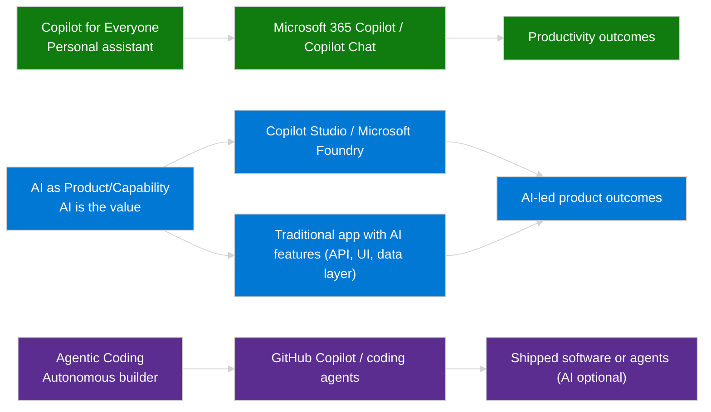

# Five-Layer Capability Model
{: .no_toc }

Microsoft's five-layer capability model is a practical map for choosing the right starting point in the Microsoft AI portfolio. It distills the official "adopt → extend → build" journey from [Adopt, extend and build Copilot experiences across the Microsoft Cloud](https://learn.microsoft.com/en-us/microsoft-cloud/dev/copilot/overview), expands it with the hands-on tiers from the [Explore the Copilot stack](https://learn.microsoft.com/en-us/training/modules/explore-copilot-stack/) module and the Copilot stack view in [Creating Generative AI Experiences with the Microsoft Cloud](https://learn.microsoft.com/en-us/microsoft-cloud/dev/copilot/isv/isv-extensibility-story#scenarios-and-approaches), and grounds it in Azure's [Application design for AI workloads](https://learn.microsoft.com/en-us/azure/well-architected/ai/application-design#application-layer-architecture).

The result is a single progression—from turnkey Microsoft 365 copilots, to governed extensibility, to Copilot Studio and Microsoft Foundry platforms, to shared Azure AI services, to specialized domain copilots—that helps you decide whether to infuse AI into an existing experience or build agents and orchestration when the scenario demands more control.

**How to use this page:** Start at Layer 1 and move up only when your requirements demand more control (data boundaries, governance, orchestration depth, channel reach, or hosting). Most successful programs combine layers over time; this model helps you do that intentionally.

## Orientation: Three Capability Buckets

Before the five-layer model, align on the three core capability buckets that describe *how* AI shows up. This keeps early conversations grounded in outcomes (who uses it and how) before you debate platforms.

| Bucket | What It Is | Key Distinction |
|--------|------------|-----------------|
| **Copilot for Everyone** | AI as personal assistant | Helps you do *your* work and life tasks |
| **AI as Product/Capability** | AI is the value delivered to end users | Standalone agents, embedded features, LLM-powered integrations—users consume AI outcomes |
| **Agentic Coding** | Autonomous technical builder | AI builds software or systems; output may or may not contain AI features |

**Insight:**

- **Copilot for Everyone:** AI boosts individual productivity and meets people where they work by clearing routine friction.
- **AI as Product/Capability:** AI *is* the product value users consume; this bucket is about shipping AI features and agents as core product components.
- **Agentic Coding:** AI is the builder (autonomous creation); GitHub Copilot’s coding agent generates and ships code—whether it’s AI-powered features or conventional apps—and behaves like a co-developer, not a helper.

## Table of contents
{: .no_toc .text-delta }

1. TOC
{:toc}

---

## Layer 1: Consumption (End-User AI)

Ready-to-use AI experiences for immediate productivity.

| Feature | Description | Documentation |
|---------|-------------|---------------|
| **Microsoft 365 Copilot Chat** | **Free (included)** enterprise-secure chat (m365copilot.com, Teams, Outlook, Edge) with GPT-4o web grounding, Copilot Pages, file uploads, image creation, and optional pay-as-you-go agents under IT control. | [Overview](https://learn.microsoft.com/en-us/copilot/overview#microsoft-365-copilot-chat-copilot-chat) · [Copilot for all announcement](https://www.microsoft.com/en-us/microsoft-365/blog/2025/01/15/copilot-for-all-introducing-microsoft-365-copilot-chat/) |
| **Microsoft 365 Copilot** | Paid hero add-on for work-grounded Copilot Chat (Graph data, multi-turn reasoning), in-app copilots, and ongoing drops (RSVP search, multi-turn image editing). Nov 2025 adds shared-mailbox grounding, agent registry export, unified permissions, org sharing, voice input. | [Overview](https://learn.microsoft.com/en-us/copilot/microsoft-365/microsoft-365-copilot-overview) · [Nov 2025 release notes](https://learn.microsoft.com/en-us/copilot/microsoft-365/release-notes?tabs=all#november-12-to-november-24,-2025) |
| **Built-in Agents** | Researcher, Analyst, Visual Creator, Prompt Coach, Idea Coach, Writing Coach | [Docs](https://learn.microsoft.com/en-us/training/modules/explore-prebuilt-microsoft-365-copilot-agents/) |
| **Agent Store** | Discover, acquire, and manage Copilot agents through the in-app Microsoft 365 store (Word and PowerPoint; Excel coming) | [Release notes](https://learn.microsoft.com/en-us/copilot/microsoft-365/release-notes) |
| **Excel Surveys Agent** | Build/analyze surveys inside Excel (Web/Win/Mac) | [Nov 2025 release notes](https://learn.microsoft.com/en-us/copilot/microsoft-365/release-notes#november-12-2025--release-overview) |
| **Custom engine agents in Office apps** | Run custom agents directly inside Word/PowerPoint/Excel clients (engine agents surfaced in desktop apps) | [Nov 2025 release notes](https://learn.microsoft.com/en-us/copilot/microsoft-365/release-notes#november-12-2025--release-overview) |

**When to use:** Reach for Layer 1 when the use case is satisfied by turnkey Microsoft 365 experiences—give users immediate productivity gains with the free Copilot Chat surface and in-app copilots, even if you plan to layer on extensibility, custom platforms, or infrastructure later.

---

## Layer 2: Extensibility (Enhance Existing Copilots)

Extend M365 Copilot with organizational knowledge and actions.

| Extension Type | Description | Documentation |
|----------------|-------------|---------------|
| **Copilot connectors (formerly Microsoft Graph connectors)** | Ingest external content into Microsoft Graph so Copilot and Microsoft Search can discover, summarize, and cite it | [Docs](https://learn.microsoft.com/en-us/graph/connecting-external-content-experiences) |
| **Model Context Protocol (MCP)** | Standardized protocol for exposing data and tools to agents; allows Dynamics 365, Logic Apps, and custom services to act as "MCP Servers" for any agent | [Docs](https://learn.microsoft.com/en-us/azure/ai-foundry/agents/how-to/tools/overview) |
| **API Plugins** | Enable declarative agents in Microsoft 365 Copilot to interact with REST APIs that have an OpenAPI description | [Docs](https://learn.microsoft.com/en-us/microsoft-365-copilot/extensibility/overview-api-plugins) |
| **Teams Message Extensions** | Extend Copilot with Teams-based actions | [Docs](https://learn.microsoft.com/en-us/microsoftteams/platform/messaging-extensions/what-are-messaging-extensions) |
| **Declarative Agents** | Configure agents with instructions, knowledge sources, and actions (MCP now GA with analytics/tracing; Dataverse/D365 MCP servers) | [Docs](https://learn.microsoft.com/en-us/microsoft-365-copilot/extensibility/build-declarative-agents) |

**When to use:** Start (or graduate to) Layer 2 anytime the use case demands company data or governed actions that turnkey copilots can’t reach—connect repositories, expose APIs, and assemble declarative agents while staying inside the Microsoft 365 trust boundary.

---

## Layer 3: Development Platforms (Build Custom Agents)

Platforms for building agents with varying levels of control and complexity.

| Technology | Description | Key Capabilities | Documentation |
|------------|-------------|------------------|---------------|
| **Copilot Studio** | Low-code to pro-code SaaS for custom agents | Managed governance, multi-channel, BYOM/BYOK, Agent2Agent (A2A) orchestration | [Docs](https://learn.microsoft.com/en-us/microsoft-copilot-studio/) |
| **Power Apps Plan Designer** | AI-assisted solution architecture | Generates Dataverse tables, roles, and app structure from natural language; accelerates Layer 3 builds | [Docs](https://learn.microsoft.com/en-us/power-apps/maker/canvas-apps/ai-overview) |
| **Microsoft Agent Framework** | Successor to Semantic Kernel and AutoGen that unifies agent and workflow development (Public Preview) | Multi-agent workflows (sequential, concurrent, handoff, Magentic), thread-based state, MCP and tool integration | [Docs](https://learn.microsoft.com/en-us/agent-framework/overview/agent-framework-overview) |
| **AG-UI Protocol Integration (Preview)** | Standardized protocol to surface Agent Framework experiences in custom web and mobile clients | Seven protocol capabilities (streaming, backend tool rendering, human-in-loop approvals, generative UI, shared/predictive state) with ASP.NET Core and FastAPI adapters; CopilotKit interoperability | [Docs](https://learn.microsoft.com/en-us/agent-framework/integrations/ag-ui/) |
| **M365 Agents SDK** | Full-stack SDK for publishing custom engine agents across Microsoft 365 Copilot, Teams, web, and custom apps | Channel adapters, conversation state, orchestrator-agnostic (Agent Framework, Semantic Kernel, LangChain) | [Docs](https://learn.microsoft.com/en-us/microsoft-365/agents-sdk/agents-sdk-overview) |
| **Microsoft Foundry (Azure)** | Unified development environment for model catalog, prompt flow, evaluations, and agent runtime (formerly Azure AI Foundry) | Integrates with Foundry Agent Service; Model Router GA (routing profiles/custom subsets, billing Nov 2025) | [Docs](https://learn.microsoft.com/en-us/azure/ai-foundry/) |
| **Foundry Agent Service** | Managed runtime for building, hosting, and scaling agent experiences | Built-in memory, tool calling, secure connectors, catalog samples; Foundry Control Plane links to policy/Defender/Purview | [Docs](https://learn.microsoft.com/en-us/azure/ai-foundry/agents/overview) |
| **LangChain Ecosystem (Third-party)** | OSS framework for LLM applications (Python/JS) | **LangChain**: Azure integrations, prompt flow; **LangGraph**: agent workflows, state management; **LangSmith**: tracing & observability | [LangChain Docs](https://learn.microsoft.com/en-us/azure/machine-learning/prompt-flow/how-to-integrate-with-langchain) \| [LangGraph Docs](https://learn.microsoft.com/en-us/azure/developer/javascript/ai/langchain-agent-on-azure) \| [LangSmith Docs](https://learn.microsoft.com/en-us/azure/ai-foundry/how-to/develop/trace-agents-sdk) |

**When to use:** Choose Layer 3 when your scenario requires bespoke logic, orchestration, or channel reach that low-code extensibility can’t deliver—this is where pro-code teams build custom agents (and you can enter here directly if the use case demands it).

---

## Layer 4: Infrastructure & AI Services (Building Blocks)

Foundational services that power agents across all platforms.

| Service | Description | Key Capabilities | Documentation |
|---------|-------------|------------------|---------------|
| **Azure OpenAI Service** | Enterprise GPT models with VNet, RBAC, tokens per minute (TPM) quotas | Managed LLM infrastructure | [Docs](https://learn.microsoft.com/en-us/azure/ai-services/openai/) |
| **Azure AI Search** | Agentic retrieval/knowledge bases with reasoning effort + partial responses, Foundry IQ integration, SharePoint ACL + sensitivity label enforcement | Semantic ranker + agentic retrieval on free tier; knowledge sources (SharePoint/OneLake/web) with content extraction | [Docs](https://learn.microsoft.com/en-us/azure/search/) |
| **Azure API Management (AI Gateway)** | Centralized governance layer | Token rate limiting, model routing, chargeback, content safety, observability | [Docs](https://learn.microsoft.com/en-us/azure/api-management/genai-gateway-capabilities) |
| **Azure AI Content Safety** | Content filtering, groundedness detection | Moderation and safety controls | [Docs](https://learn.microsoft.com/en-us/azure/ai-services/content-safety/) |
| **Azure AI Content Understanding (Preview)** | Multimodal content processing with generative AI | Document, image, audio, video analysis; zero-shot extraction; grounding & confidence scoring; RAG-ready | [Docs](https://learn.microsoft.com/en-us/azure/ai-services/content-understanding/document/overview) |
| **Prompt Flow** | GenAIOps for evaluations and orchestration | Model testing and deployment | [Docs](https://learn.microsoft.com/en-us/azure/machine-learning/prompt-flow/overview-what-is-prompt-flow) |
| **AI Builder** | Comprehensive prebuilt & custom AI models for Power Platform | Document processing (invoices, receipts, contracts), GPT text generation, sentiment analysis, entity extraction, vision (object detection, OCR), predictions | [Docs](https://learn.microsoft.com/en-us/ai-builder/) |
| **Copilot Studio Agent Flows** | Native automation workflows within Copilot Studio | Deterministic automation for agents; natural language or visual designer; billed via Copilot Studio capacity | [Docs](https://learn.microsoft.com/en-us/microsoft-copilot-studio/flows-overview) |
| **Azure Document Intelligence** | Prebuilt and custom document models | OCR and document understanding | [Docs](https://learn.microsoft.com/en-us/azure/ai-services/document-intelligence/) |
| **Azure Logic Apps** | Enterprise workflow automation with 1,400+ connectors | Expose Standard logic apps as remote MCP servers for agent tools, integrate with enterprise systems, monitor via Application Insights | [Docs](https://learn.microsoft.com/en-us/azure/logic-apps/set-up-model-context-protocol-server-standard) |
| **Azure Cosmos DB** | Globally distributed NoSQL database with AI capabilities | Vector search (IVF, HNSW, DiskANN), AI agent memory system, integrated vector database | [Docs](https://learn.microsoft.com/en-us/azure/cosmos-db/nosql/vector-search) |
| **Azure Database for PostgreSQL** | Fully managed PostgreSQL with AI extensions | azure_ai extension (OpenAI + Cognitive Services), pgvector for vector search, in-database embeddings | [Docs](https://learn.microsoft.com/en-us/azure/postgresql/flexible-server/generative-ai-azure-overview) |
| **SQL Server 2025 (Preview)** | Enterprise database with native AI capabilities | VECTOR data type (float32/float16), vector functions & indexes (DiskANN), external AI model management, Copilot in SSMS | [Docs](https://learn.microsoft.com/en-us/sql/sql-server/what-s-new-in-sql-server-2025) |
| **Microsoft Fabric** | Unified analytics platform with AI capabilities | **Platform:** Lakehouse (Delta tables), Warehouse (T-SQL), OneLake (unified storage), SQL analytics endpoint, Microsoft Foundry integration. **AI Layer:** Copilot in Fabric (data science, factory, warehouse, Power BI, Real-Time Intelligence), Fabric Data Agents (Preview) | [Docs](https://learn.microsoft.com/en-us/fabric/fundamentals/microsoft-fabric-overview) |
| **Agent 365 (Preview)** | Entra-backed agent identity, registry, conditional access, prompt shield/risky-agent detection | Agent registry and lifecycle governance for agents across experiences | [Docs](https://learn.microsoft.com/en-us/microsoft-agent-365/overview) |
| **Foundry Control Plane** | Agent registry and policy/security hub | Integrates Defender, Purview, Azure Policy for agent posture and RBAC | [Docs](https://learn.microsoft.com/en-us/azure/ai-foundry/control-plane/overview) |
| **Windows AI Foundry / Edge AI** | Local inference runtime for Windows | **Foundry Local:** Run OSS models (Phi-4-mini) on NPU/GPU/CPU; **Edge AI APIs:** Zero-latency inference in browser; **MCP on Windows:** Local agent tools | [Docs](https://learn.microsoft.com/en-us/windows/ai/) |

**When to use:** Prioritize Layer 4 when the use case hinges on shared AI infrastructure (vector storage, automation, governance, evaluations) or strict compliance/scale requirements—even if higher layers are still in-flight, these building blocks keep every copilot sustainable.

---

## Layer 5: Specialized Copilots (Domain-Specific)

Purpose-built AI assistants for specific workflows and industries.

| Copilot | Description | Primary Use Cases | Documentation |
|---------|-------------|-------------------|---------------|
| **GitHub Copilot** | Code generation and developer productivity | AI-assisted coding | [Docs](https://github.com/features/copilot) |
| **Security Copilot** | Security operations and threat analysis | SOC automation | [Docs](https://learn.microsoft.com/en-us/security-copilot/) |
| **Security Copilot (M365 E5)** | Included with Microsoft 365 E5; 12 built agents for SOC | SOC workflows with agent catalog, no extra license for E5 | [Announcement](https://learn.microsoft.com/en-us/partner-center/announcements/2025-december#access-security-copilot-with-microsoft-365-e5) |
| **Dynamics 365 Copilots** | Sales, Service, Marketing, Finance agents | CRM and ERP workflows | [Docs](https://learn.microsoft.com/en-us/dynamics365/release-plan/) |
| **Microsoft Fabric Data Agents (Preview)** | Conversational AI agents for analytics data | Transform enterprise data into Q&A systems; integrate with Copilot Studio, Foundry Agent Service, Power BI Copilot | [Docs](https://learn.microsoft.com/en-us/fabric/data-science/concept-data-agent) |
| **Azure SRE Agent (Preview)** | AI-powered site reliability engineering assistant | Incident automation, explainable RCA, proactive monitoring, natural language Azure resource insights | [Docs](https://learn.microsoft.com/en-us/azure/sre-agent/overview) |
| **GitHub Copilot Coding Agent** | Agentic multi-file editing and autonomous issue resolution | Assigned GitHub issues create PRs; workspace-wide edits; Azure MCP Server integration | [Docs](https://learn.microsoft.com/en-us/azure/developer/azure-mcp-server/how-to/github-copilot-coding-agent) |

**When to use:** Enter at Layer 5 when a Microsoft or partner copilot already addresses the domain outcome (developer, security, CRM, analytics); deploy it for fast impact, then supplement with lower layers only where gaps remain.

---

**Next:** [Decision Framework]({{ '/docs/decision-framework' | relative_url }}) - Apply BXT and critical questions to shortlist technologies

---

## Sources

**Layer 1 & 2:**

- [Copilot for all: Introducing Microsoft 365 Copilot Chat](https://www.microsoft.com/en-us/microsoft-365/blog/2025/01/15/copilot-for-all-introducing-microsoft-365-copilot-chat/) (Updated: January 2025)
- [M365 Copilot Extensibility](https://learn.microsoft.com/en-us/microsoft-365-copilot/extensibility/overview) (Updated: September 2025)
- [M365 Release Notes](https://learn.microsoft.com/en-us/copilot/microsoft-365/release-notes) (Updated: November 12, 2025)

**Layer 3:**

- [Foundry Agent Service](https://learn.microsoft.com/en-us/azure/ai-foundry/agents/whats-new) (Updated: April 2025)
- [Microsoft Agent Framework Overview](https://learn.microsoft.com/en-us/dotnet/api/overview/azure/ai.projects.agent-readme) (Updated: 2025)
- [Agent Framework with M365 SDK](https://learn.microsoft.com/en-us/microsoft-365/agents-sdk/semantic-kernel-agent-framework) (Updated: 2025)
- [AG-UI Integration with Agent Framework](https://learn.microsoft.com/en-us/agent-framework/integrations/ag-ui/) (Preview, Updated: November 11, 2025)
- [LangChain with Azure Machine Learning (Third-party)](https://learn.microsoft.com/en-us/azure/machine-learning/prompt-flow/how-to-integrate-with-langchain) (Updated: 2025)
- [LangGraph Tutorial with Azure AI Search (Third-party)](https://learn.microsoft.com/en-us/azure/developer/javascript/ai/langchain-agent-on-azure) (Updated: 2025)
- [LangSmith Tracing for Agents (Third-party)](https://learn.microsoft.com/en-us/azure/ai-foundry/how-to/develop/trace-agents-sdk) (Updated: 2025)

**Layer 4:**

- [Azure AI Content Understanding Document Solutions](https://learn.microsoft.com/en-us/azure/ai-services/content-understanding/document/overview) (Preview, Updated: 2025)
- [Azure Cosmos DB Vector Search for NoSQL](https://learn.microsoft.com/en-us/azure/cosmos-db/nosql/vector-search) (GA, Updated: 2025)
- [Azure Database for PostgreSQL - Azure AI Extension](https://learn.microsoft.com/en-us/azure/postgresql/flexible-server/generative-ai-azure-overview) (GA, Updated: 2025)
- [SQL Server 2025 - What's New](https://learn.microsoft.com/en-us/sql/sql-server/what-s-new-in-sql-server-2025) (Preview, Updated: November 2025)
- [Microsoft Fabric - Copilot Overview](https://learn.microsoft.com/en-us/fabric/fundamentals/copilot-fabric-overview) (GA, Updated: 2025)
- [AI Builder Overview](https://learn.microsoft.com/en-us/ai-builder/overview) (Updated: 2025 Release Wave 1)
- [Copilot Studio Agent Flows Overview](https://learn.microsoft.com/en-us/microsoft-copilot-studio/flows-overview) (Updated: 2025 Release Wave 1)

**Layer 5:**

- [Azure SRE Agent Overview](https://learn.microsoft.com/en-us/azure/sre-agent/overview) (Preview, Updated: 2025)
- [GitHub Copilot Coding Agent - Azure MCP Integration](https://learn.microsoft.com/en-us/azure/developer/azure-mcp-server/how-to/github-copilot-coding-agent) (Updated: 2025)

**Model Overview:**

- [Adopt, extend and build Copilot experiences across the Microsoft Cloud](https://learn.microsoft.com/en-us/microsoft-cloud/dev/copilot/overview) (Updated: 2025)
- [Explore the Copilot stack - Training Module](https://learn.microsoft.com/en-us/training/modules/explore-copilot-stack/) (Updated: 2025)
- [Creating Generative AI Experiences with the Microsoft Cloud: A Guide for ISVs](https://learn.microsoft.com/en-us/microsoft-cloud/dev/copilot/isv/isv-extensibility-story#scenarios-and-approaches) (Updated: 2025)
- [Application design for AI workloads on Azure](https://learn.microsoft.com/en-us/azure/well-architected/ai/application-design#application-layer-architecture) (Updated: 2025)
