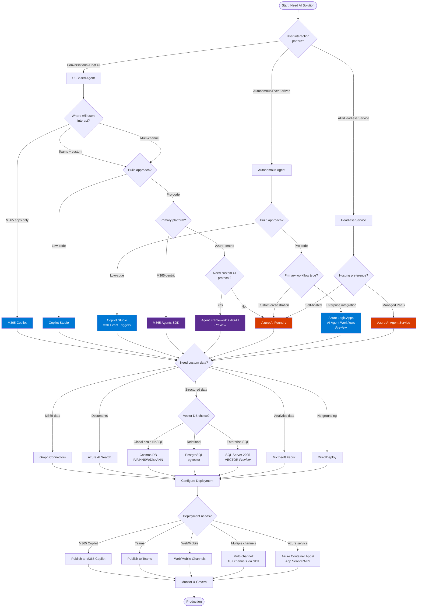
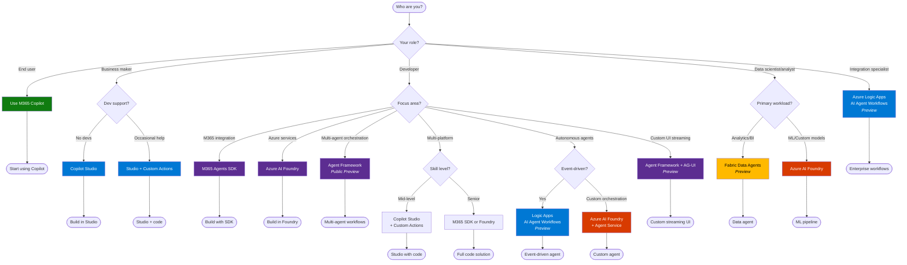
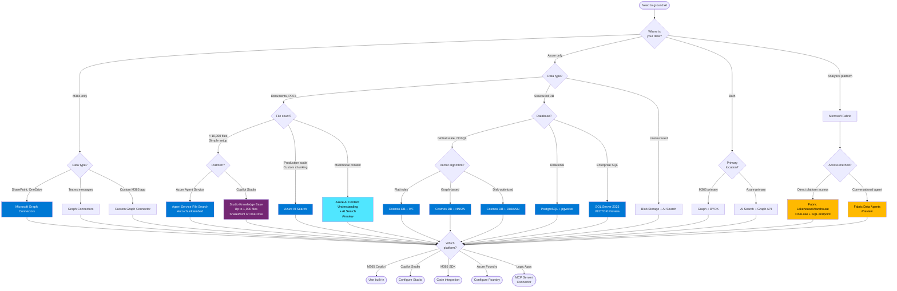
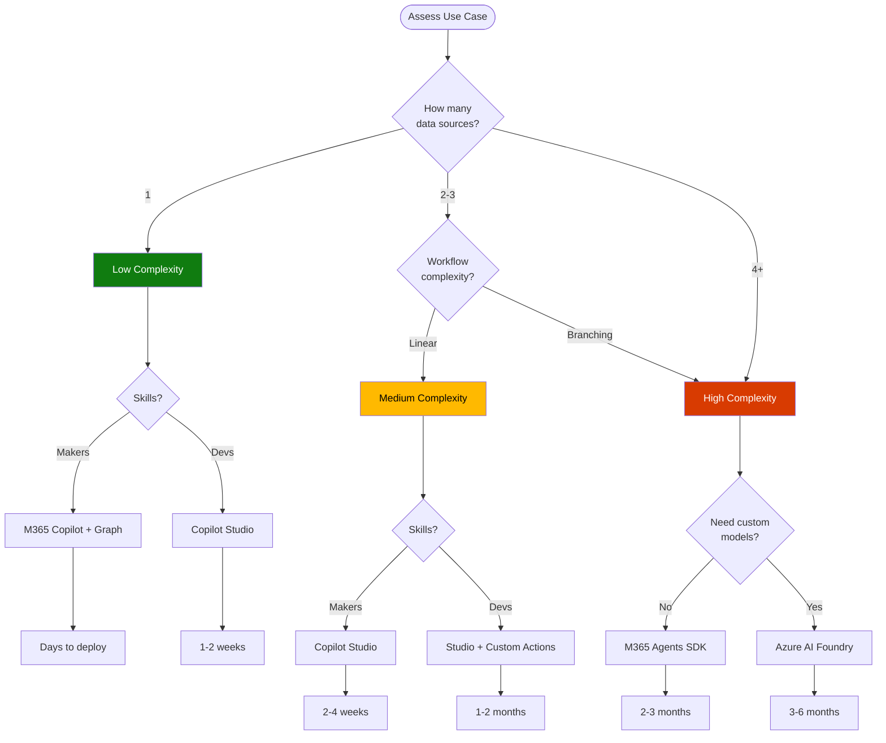
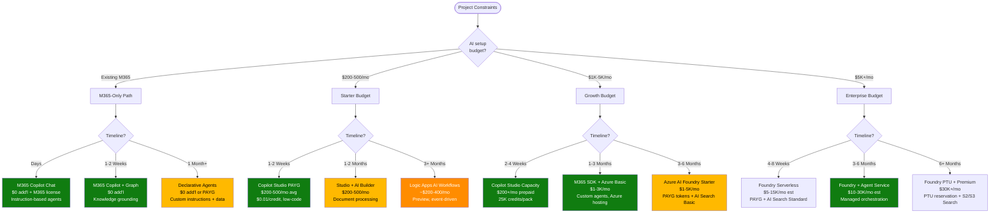
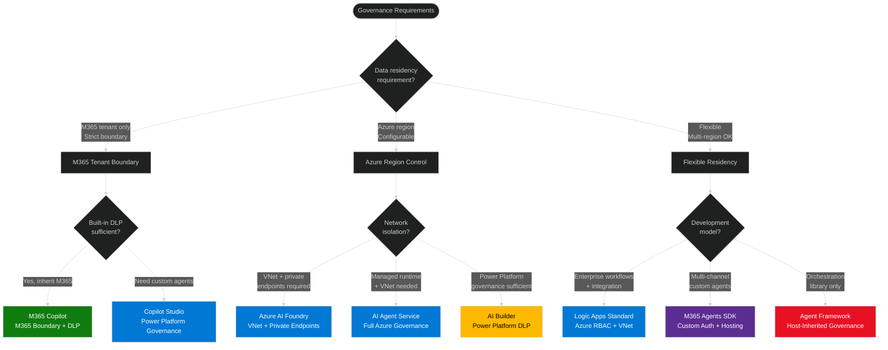
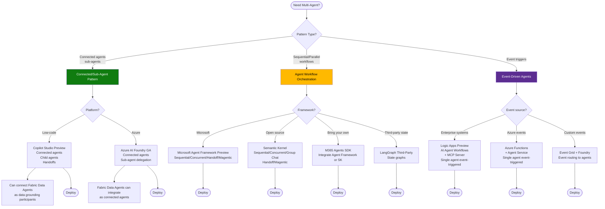

# Visual Framework
{: .no_toc }

Interactive decision trees to guide Microsoft AI technology selection.
{: .fs-6 .fw-300 }

{: .note }
Use these diagrams after working through the [Decision Framework]({{ '/docs/decision-framework' | relative_url }}) and [Evaluation Criteria]({{ '/docs/evaluation-criteria' | relative_url }}). They reinforce the nine critical questions and help facilitate workshops or executive readouts.

## Table of contents
{: .no_toc .text-delta }

1. TOC
{:toc}

---

## Diagram Index

| Diagram | Purpose | Maps To Framework |
|---------|---------|-------------------|
| **1. Complete Decision Flow** | End-to-end technology selection | [Phase 2: Q1-Q9]({{ '/docs/decision-framework#phase-2-technology-groupings-nine-critical-questions' | relative_url }}) - All nine critical questions |
| **2. Data Grounding Decision** | Data strategy and knowledge sources | [Phase 2: Q4]({{ '/docs/decision-framework#question-4-data-strategy--knowledge' | relative_url }}) - Data grounding patterns |
| **3. Persona-Based Flow** | Selection by role and skill level | [Phase 2: Q2]({{ '/docs/decision-framework#question-2-build-style--control-level' | relative_url }}) - Build approach + [Scenarios]({{ '/docs/scenarios' | relative_url }}) |
| **4. Complexity Assessment** | Technical complexity evaluation | [Evaluation Criteria: Complexity]({{ '/docs/evaluation-criteria#technical-complexity-assessment' | relative_url }}) |
| **5. Budget & Timeline** | Cost and time-to-production paths | [Evaluation Criteria: Budget & Time]({{ '/docs/evaluation-criteria#budget-assessment' | relative_url }}) |
| **6. Governance & Compliance** | Security and compliance requirements | [Evaluation Criteria: Governance]({{ '/docs/evaluation-criteria#governance--compliance' | relative_url }}) |
| **7. Multi-Agent Orchestration** | Multi-agent patterns and frameworks | [Quick Reference: Orchestration Complexity]({{ '/docs/quick-reference#orchestration-complexity-decision-matrix' | relative_url }}) |

---

## Complete Decision Flow

### Validation Summary
{: .no_toc }

**Last Validated:** November 2025

#### UI-Based Agents (GA unless noted)
{: .no_toc }

| Technology | Action Safety | Proactive | Description |
|------------|---------------|-----------|-------------|
| **M365 Copilot** | 🔒 User-in-the-loop always | 🔄 Reactive only | Conversational chat in M365 apps [(docs)](https://learn.microsoft.com/en-us/microsoft-365-copilot/extensibility/) |
| **Copilot Studio** | ⚠️ Actions can execute (add approval workflows) | 🔄 Reactive (conversational) or **✅ Autonomous (event triggers)** | Low-code, 13+ channels [(docs)](https://learn.microsoft.com/en-us/microsoft-copilot-studio/fundamentals-what-is-copilot-studio) |
| **M365 Agents SDK** | ⚠️ Custom action safety design | ✅ Proactive capable | Pro-code, 10+ channels, C#/JS/Python, BYO orchestrator [(docs)](https://learn.microsoft.com/en-us/microsoft-365/agents-sdk/agents-sdk-overview) |
| **Azure AI Foundry** | ⚠️ Autonomous planning loops | ✅ Proactive capable | Custom UI deployment [(docs)](https://learn.microsoft.com/en-us/azure/ai-foundry/openai/how-to/use-web-app) |
| **Agent Framework + AG-UI** (Preview) | ⚠️ Approvals via AG-UI middleware | ✅ Proactive capable (inherits host orchestration) | Protocol bridges agents to web/mobile UI with SSE streaming, backend tool rendering, shared state, and CopilotKit components [(docs)](https://learn.microsoft.com/en-us/agent-framework/integrations/ag-ui/) |

#### Autonomous Agents
{: .no_toc }

| Technology | Action Safety | Proactive | Description |
|------------|---------------|-----------|-------------|
| **Copilot Studio** (with event triggers) | ⚠️ Actions can execute | ✅ Autonomous (event-driven) | Event triggers: SharePoint, OneDrive, Planner, Recurrence [(docs)](https://learn.microsoft.com/en-us/microsoft-copilot-studio/authoring-triggers-about) |
| **Logic Apps AI Agent Workflows** (Preview) | ⚠️ Autonomous execution | ✅ Proactive (event-driven) | 1,400+ connectors [(docs)](https://learn.microsoft.com/en-us/azure/logic-apps/agent-workflows-concepts) |
| **Azure AI Foundry Agent Service** | ⚠️ Autonomous planning loops | ✅ Proactive capable | Custom orchestration [(docs)](https://learn.microsoft.com/en-us/azure/ai-foundry/agents/overview) |

#### API/Headless Services (GA)
{: .no_toc }

| Technology | Action Safety | Proactive | Description |
|------------|---------------|-----------|-------------|
| **Azure AI Agent Service** | ⚠️ Autonomous planning loops | ✅ Proactive capable | REST API, managed PaaS [(docs)](https://learn.microsoft.com/en-us/azure/ai-foundry/agents/quickstart) |
| **Azure AI Foundry** | ⚠️ Autonomous planning loops | ✅ Proactive capable | REST API deployment [(docs)](https://learn.microsoft.com/en-us/rest/api/aifoundry/) |

#### Vector Databases
{: .no_toc }

| Technology | Status | Capabilities |
|------------|--------|--------------|
| **Cosmos DB** | GA | IVF, HNSW, DiskANN algorithms [(docs)](https://learn.microsoft.com/en-us/azure/cosmos-db/nosql/vector-search) |
| **PostgreSQL pgvector** | GA | Extension 0.7.0 [(docs)](https://learn.microsoft.com/en-us/azure/postgresql/flexible-server/how-to-use-pgvector) |
| **SQL Server 2025 VECTOR** | Preview | Native type, float32/float16 [(docs)](https://learn.microsoft.com/en-us/sql/t-sql/data-types/vector-data-type) |

---

## Persona-Based Flow

### Validation Summary - Persona-Based Flow
{: .no_toc }

**Last Validated:** November 3, 2025

#### End User (GA)
{: .no_toc }

| Technology | Description | Documentation |
|------------|-------------|---------------|
| **M365 Copilot** | Built-in AI in M365 apps, no setup required | [M365 Copilot](https://learn.microsoft.com/en-us/microsoft-365-copilot/extensibility/) |

#### Business Maker (GA)
{: .no_toc }

| Technology | Description | Documentation |
|------------|-------------|---------------|
| **Copilot Studio** | Low-code platform, no dev support needed | [Copilot Studio](https://learn.microsoft.com/en-us/microsoft-copilot-studio/fundamentals-what-is-copilot-studio) |
| **Copilot Studio + Custom Actions** | Low-code with occasional developer support for custom connectors/flows | [Custom Actions](https://learn.microsoft.com/en-us/microsoft-copilot-studio/copilot-plugins-overview) |

#### Developer (GA unless noted)
{: .no_toc }

| Technology | Description | Documentation |
|------------|-------------|---------------|
| **M365 Agents SDK** | Pro-code for M365-centric solutions, C#/JavaScript/Python, 10+ channels, BYO orchestrator | [M365 Agents SDK](https://learn.microsoft.com/en-us/microsoft-365-copilot/extensibility/overview-custom-engine-agent) |
| **Azure AI Foundry** | Pro-code for Azure-centric solutions, custom models, full control | [Azure AI Foundry](https://learn.microsoft.com/en-us/azure/ai-foundry/what-is-azure-ai-foundry) |
| **Microsoft Agent Framework** (Public Preview) | **Microsoft's investment direction** - Next-gen multi-agent orchestration framework (5 patterns: Sequential, Concurrent, Handoff, Group Chat, Magentic). **Use instead of Semantic Kernel** (maintenance mode). Works with M365 SDK or standalone. | [Agent Framework](https://learn.microsoft.com/en-us/agent-framework/) |
| **Agent Framework + AG-UI** (Preview) | Protocol layer for web/mobile clients, supports SSE streaming, backend tool rendering, human approvals, shared/predictive state, and CopilotKit components. | [AG-UI Integration](https://learn.microsoft.com/en-us/agent-framework/integrations/ag-ui/) |
| **Copilot Studio + Custom Actions** | Mid-level developers, low-code with custom code extensibility | [Copilot Studio Extensibility](https://learn.microsoft.com/en-us/microsoft-copilot-studio/copilot-plugins-overview) |
| **Logic Apps AI Agent Workflows** (Preview) | Event-driven autonomous agents, 1,400+ connectors | [Logic Apps Agent Workflows](https://learn.microsoft.com/en-us/azure/logic-apps/agent-workflows-concepts) |

#### Data Scientist/Analyst
{: .no_toc }

| Technology | Description | Documentation |
|------------|-------------|---------------|
| **Fabric Data Agents** (Preview) | Analytics/BI focus, Python SDK, evaluation capabilities, Power BI/semantic models | [Fabric Data Agents](https://learn.microsoft.com/en-us/fabric/data-science/concept-data-agent) \| [Python SDK](https://learn.microsoft.com/en-us/fabric/data-science/evaluate-data-agent) |
| **Azure AI Foundry** | ML/custom models, full AI/ML pipeline control | [Azure AI Foundry](https://learn.microsoft.com/en-us/azure/ai-foundry/what-is-azure-ai-foundry) |

#### Integration Specialist
{: .no_toc }

| Technology | Description | Documentation |
|------------|-------------|---------------|
| **Logic Apps AI Agent Workflows** (Preview) | Enterprise integration focus, 1,400+ connectors, workflow automation | [Logic Apps Overview](https://learn.microsoft.com/en-us/azure/logic-apps/logic-apps-overview) \| [AI Agent Workflows](https://learn.microsoft.com/en-us/azure/logic-apps/agent-workflows-concepts) |

---

## Data Grounding Decision

### Validation Summary - Data Grounding Decision
{: .no_toc }

**Last Validated:** November 3, 2025

#### M365 Data Sources (GA)
{: .no_toc }

| Technology | Capabilities | Documentation |
|------------|--------------|---------------|
| **Microsoft Graph Connectors** | M365 data sources (SharePoint, OneDrive, Teams) | [Graph Connectors Overview](https://learn.microsoft.com/en-us/microsoftsearch/connectors-overview) |

#### Document Processing - File Search (GA)
{: .no_toc }

| Technology | Capabilities | Documentation |
|------------|--------------|---------------|
| **Azure AI Agent Service File Search Tool** | Built-in file search with automatic parsing, chunking (800 tokens/400 overlap), embedding (text-embedding-3-large), keyword + semantic search, reranking. Supports up to 10,000 files per vector store (max 512 MB/file). Two modes: Basic (Microsoft-managed) vs Standard (BYO Azure AI Search + Blob Storage). Supported formats: .doc, .docx, .pdf, .pptx, .py, .md, .txt, .json, .html, .java, .cs, .cpp, and more. Service handles entire ingestion automatically. | [Agent Service File Search](https://learn.microsoft.com/en-us/azure/ai-foundry/agents/how-to/tools/file-search) |
| **Copilot Studio Knowledge Base** | File upload from local/OneDrive/SharePoint. Supports .doc, .docx, .ppt, .pptx, .pdf, .xls, .xlsx, .txt, .md, .html, .csv, .xml. Max 512 MB per file. Direct uploads allow up to 500 files per agent, while SharePoint/OneDrive document sources now support up to 1,000 files (GA Oct 6, 2025). Automatic chunking and vectorization into Dataverse with semantic indexing. OneDrive/SharePoint: Auto-sync (updates reflected automatically) vs Upload: Static files. SharePoint: User-scoped permissions (only files user has access to). | [Copilot Studio Knowledge](https://learn.microsoft.com/en-us/microsoft-copilot-studio/knowledge-unstructured-data) \| [File Upload](https://learn.microsoft.com/en-us/microsoft-copilot-studio/knowledge-add-file-upload) \| [SharePoint Files](https://learn.microsoft.com/en-us/microsoft-copilot-studio/knowledge-add-unstructured-data) \| [Use up to 1000 files](https://learn.microsoft.com/en-us/power-platform/release-plan/2025wave1/microsoft-copilot-studio/use-up-1000-files-per-agent-sharepoint-onedrive-uploads) |

#### Document Processing - Production Scale (GA)
{: .no_toc }

| Technology | Capabilities | Documentation |
|------------|--------------|---------------|
| **Azure AI Search** | Document indexing, full-text search, vector search, hybrid queries, custom chunking strategies (fixed-size, variable-size, Document Layout skill). Requires manual setup of indexers, skillsets, chunking strategy. Production-scale scenarios with millions of documents. | [AI Search Overview](https://learn.microsoft.com/en-us/azure/search/search-what-is-azure-search) \| [Chunking Strategies](https://learn.microsoft.com/en-us/azure/search/vector-search-how-to-chunk-documents) |

#### Document Processing - Multimodal (Preview)
{: .no_toc }

| Technology | Capabilities | Documentation |
|------------|--------------|---------------|
| **Azure AI Content Understanding** | Multimodal processing (documents/images/audio/video), RAG-ready Markdown output, AI Search custom skill integration, built-in chunking, standard/pro modes. API version: 2025-05-01-preview. | [Content Understanding Overview](https://learn.microsoft.com/en-us/azure/ai-services/content-understanding/overview) \| [Multimodal Search](https://learn.microsoft.com/en-us/azure/search/multimodal-search-overview) |

#### Structured Databases - Vector Search (GA)
{: .no_toc }

| Technology | Status | Capabilities | Documentation |
|------------|--------|--------------|---------------|
| **Cosmos DB Vector Search** | GA | IVF/HNSW/DiskANN algorithms, NoSQL & MongoDB vCore APIs | [Cosmos DB Vector Search](https://learn.microsoft.com/en-us/azure/cosmos-db/vector-database) |
| **PostgreSQL pgvector** | GA | Extension version 0.7.0, HNSW/IVF indexes | [PostgreSQL Vector Search](https://learn.microsoft.com/en-us/azure/postgresql/flexible-server/how-to-use-pgvector) |
| **SQL Server 2025 VECTOR** | Preview RC1 | Native VECTOR data type, float32 (1,998 dims)/float16 (3,996 dims) | [SQL Server Vector](https://learn.microsoft.com/en-us/sql/t-sql/data-types/vector-data-type) |

#### Analytics Platform (GA with Preview features)
{: .no_toc }

| Technology | Status | Capabilities | Documentation |
|------------|--------|--------------|---------------|
| **Microsoft Fabric Platform** | GA | Direct knowledge source access via Lakehouse (Delta tables, Spark), Warehouse (T-SQL), OneLake (ADLS Gen2 APIs), KQL databases. Azure AI Foundry integration for RAG | [Fabric Overview](https://learn.microsoft.com/en-us/fabric/fundamentals/microsoft-fabric-overview) \| [AI Foundry Fabric Integration](https://learn.microsoft.com/en-us/azure/ai-foundry/faq) |
| **Fabric Data Agents** | Preview | Analytics data grounding (warehouses, lakehouses, Power BI semantic models, KQL databases), Copilot Studio connected agents, Azure AI Agent Service integration | [Fabric Data Agents](https://learn.microsoft.com/en-us/fabric/data-science/concept-data-agent) \| [Copilot Studio Integration](https://learn.microsoft.com/en-us/fabric/data-science/data-agent-microsoft-copilot-studio) |

#### MCP Integration (Preview)
{: .no_toc }

| Technology | Capabilities | Documentation |
|------------|--------------|---------------|
| **Logic Apps MCP Server** | Standard logic apps as remote MCP servers, 1,400+ connectors, OAuth 2.0 auth, Streamable HTTP/SSE transports | [Logic Apps MCP Server](https://learn.microsoft.com/en-us/azure/logic-apps/set-up-model-context-protocol-server-standard) \| [API Center Integration](https://learn.microsoft.com/en-us/azure/logic-apps/create-mcp-server-api-center) |

#### When to Use File Search vs Azure AI Search
{: .no_toc }

| Solution | Use When | Cost |
|----------|----------|------|
| **File Search (Agent Service/Copilot Studio)** | Up to 10,000 files, simple setup (no manual indexer/chunking config), automatic embedding, suitable for smaller document sets, internal knowledge bases, rapid prototyping | Included in Agent Service consumption or Copilot Studio credits |
| **Azure AI Search** | Production scale (millions of documents), custom chunking strategies required, advanced features (analyzers, scoring profiles, faceting), complex indexing pipelines, enterprise search | Dedicated AI Search tier (Basic ~$75/mo to S3 ~$3K/mo) |

---

## Complexity Assessment Flow

---

## Budget & Timeline Tradeoffs

### Validation Summary - Budget & Timeline Tradeoffs
{: .no_toc }

**Last Validated:** November 3, 2025

#### M365-Only ($0 AI infrastructure add'l)
{: .no_toc }

| Solution | Monthly Cost | Documentation |
|----------|--------------|---------------|
| **M365 Copilot Chat** | Included with M365 subscription | Web-grounded chat and instruction-based agents [(docs)](https://learn.microsoft.com/en-us/microsoft-365-copilot/extensibility/cost-considerations#licensing-options-for-microsoft-365-copilot) |
| **M365 Copilot + Graph Connectors** | $30/user/month M365 Copilot license | Graph Connectors included at no extra charge [(docs)](https://learn.microsoft.com/en-us/microsoft-copilot-studio/billing-licensing#copilot-studio-use-rights-included-with-microsoft-365-copilot-license) |
| **Declarative Agents** | $0 or PAYG | Instruction-based or public-web grounded = $0; shared tenant data = PAYG [(docs)](https://learn.microsoft.com/en-us/microsoft-365-copilot/extensibility/cost-considerations#agents-in-copilot) |

#### Starter ($200-500/mo)
{: .no_toc }

| Solution | Monthly Cost | Documentation |
|----------|--------------|---------------|
| **Copilot Studio PAYG** | $200-500/mo (typical) | $0.01 per Copilot Credit [(docs)](https://learn.microsoft.com/en-us/microsoft-copilot-studio/billing-licensing#copilot-studio-pay-as-you-go) |
| **AI Builder** | Included in Power Platform | Document processing (invoices, receipts, contracts) [(docs)](https://learn.microsoft.com/en-us/ai-builder/overview) |
| **Logic Apps AI Workflows** (Preview) | $200-400/mo (typical) | Consumption pricing, event-driven agents [(docs)](https://learn.microsoft.com/en-us/azure/logic-apps/agent-workflows-concepts) |

#### Growth ($1K-5K/mo)
{: .no_toc }

| Solution | Monthly Cost | Documentation |
|----------|--------------|---------------|
| **Copilot Studio Capacity Packs** | $200/month per 25,000 credits | Prepaid [(docs)](https://learn.microsoft.com/en-us/microsoft-copilot-studio/billing-licensing#copilot-studio-prepaid-copilot-credits-subscription) |
| **M365 SDK + Azure** | $600-2.3K/mo | SDK free; Azure hosting (App Service ~$100-300/mo) + Azure OpenAI PAYG (~$500-2K/mo tokens) [(docs)](https://learn.microsoft.com/en-us/microsoft-365-copilot/extensibility/cost-considerations#agents-in-copilot) |
| **Azure AI Foundry Starter** | $1-5K/mo estimate | PAYG tokens + AI Search Basic (~$75/mo) [(OpenAI pricing)](https://azure.microsoft.com/pricing/details/cognitive-services/openai-service/) \| [(AI Search pricing)](https://learn.microsoft.com/en-us/azure/search/search-sku-tier#tier-descriptions) |

#### Enterprise ($5K+/mo)
{: .no_toc }

| Solution | Monthly Cost | Documentation |
|----------|--------------|---------------|
| **Foundry Serverless** | $5-15K/mo | PAYG tokens at scale + AI Search Standard S1 (~$250/mo) [(docs)](https://learn.microsoft.com/en-us/azure/search/search-sku-tier#tier-descriptions) |
| **Foundry + Agent Service** | $10-30K/mo | Managed orchestration PaaS + AI Search S2 (~$1K/mo) [(docs)](https://learn.microsoft.com/en-us/azure/ai-foundry/agents/overview) |
| **Foundry PTU + Premium** | $30K+/mo | PTU reservations (50+ PTUs minimum) + AI Search S2/S3 [(docs)](https://learn.microsoft.com/en-us/azure/ai-foundry/openai/how-to/provisioned-throughput-onboarding#hourly-usage) |

#### Timeline Estimates
{: .no_toc }

| Timeline | Use Case | Example Scenario |
|----------|----------|------------------|
| **Days** | M365 built-in features, no development | [(scenarios)](https://learn.microsoft.com/en-us/microsoft-365-copilot/extensibility/overview) |
| **1-2 Weeks** | Low-code platforms (Copilot Studio, Logic Apps) | [(HR Knowledge Base scenario)]({{ '/docs/scenarios' | relative_url }}) |
| **1-3 Months** | Custom agents with SDKs, moderate complexity | [(Customer Support scenario)]({{ '/docs/scenarios' | relative_url }}) |
| **3-6 Months** | Azure AI Foundry custom solutions, complex orchestration | [(evaluation-criteria)]({{ '/docs/evaluation-criteria#time-to-production' | relative_url }}) |
| **6+ Months** | Enterprise-scale with PTU, fine-tuning, advanced patterns | |

#### Cost Calculation Notes
{: .no_toc }

- M365 per-user costs ($30/user/month) NOT included in bands - these are AI infrastructure costs only
- Estimates assume moderate usage (not high-scale production)
- Azure consumption highly variable based on tokens, requests, storage
- PTU (Provisioned Throughput Units) require Azure Reservations for cost optimization

#### Sources
{: .no_toc }

- [Copilot Studio Licensing](https://learn.microsoft.com/en-us/microsoft-copilot-studio/billing-licensing) (Updated: 2025)
- [M365 Copilot Cost Considerations](https://learn.microsoft.com/en-us/microsoft-365-copilot/extensibility/cost-considerations) (Updated: 2025)
- [Azure OpenAI Pricing](https://azure.microsoft.com/pricing/details/cognitive-services/openai-service/) (Updated: 2025)
- [Azure AI Search Tiers](https://learn.microsoft.com/en-us/azure/search/search-sku-tier) (Updated: 2025)
- [Logic Apps AI Agent Workflows](https://learn.microsoft.com/en-us/azure/logic-apps/agent-workflows-concepts) (Preview, Updated: 2025)
- [AI Builder Overview](https://learn.microsoft.com/en-us/ai-builder/overview) (Updated: 2025)

---

## Governance & Compliance Path

### Validation Summary: Governance & Compliance Path
{: .no_toc }

**Last Validated:** November 2025

#### M365 Tenant Boundary Technologies
{: .no_toc }

| Technology | Action Safety | Proactive | Data Grounding/Memory/Analytics | Key Governance Features | Documentation |
|------------|---------------|-----------|----------------------------------|------------------------|---------------|
| **M365 Copilot** (GA) | ✅ User-in-the-loop (drafts only) | ❌ Reactive only | Grounding only (M365 Graph per-request), no extractable memory | M365 trust boundary, auto DLP/sensitivity labels, user-scoped permissions, Purview audit, no training on tenant data | [M365 Copilot Security](https://learn.microsoft.com/en-us/copilot/microsoft-365/microsoft-365-copilot-ai-security) |
| **Copilot Studio** (GA) | ⚠️ Actions execute (flows/connectors) | ✅ Autonomous (event triggers) | Grounding + Dataverse persistence (transcripts, variables), full analytics | Power Platform RBAC + DLP, environment-level governance, connector controls, ⚠️ web search leaves boundary, ⚠️ dual auth (user/service) | [Copilot Studio Security](https://learn.microsoft.com/en-us/microsoft-copilot-studio/security-and-governance) |

#### Azure Region Control Technologies
{: .no_toc }

| Technology | Action Safety | Proactive | Data Grounding/Memory/Analytics | Key Governance Features | Documentation |
|------------|---------------|-----------|----------------------------------|------------------------|---------------|
| **Azure AI Foundry** (GA) | ⚠️ Tool calling with autonomous planning | ✅ Proactive (Azure Functions, Logic Apps) | Grounding + BYO thread storage (Cosmos DB), Azure Monitor + OpenTelemetry | Azure RBAC (control + data plane), VNet + private endpoints, managed identity, CMK optional, ⚠️ API key OR Entra ID (Entra recommended) | [Azure AI Foundry Security](https://learn.microsoft.com/en-us/azure/ai-foundry/concepts/planning) |
| **AI Agent Service** | ⚠️ Autonomous with action tools (Logic Apps, Functions, MCP) | ✅ Proactive (event triggers) | BYO thread storage (Cosmos DB), Azure Monitor project-scoped | Full RBAC (project + resource), VNet + private endpoints, BYO storage, no public egress by default, container injection for VNet | [Agent Service Security](https://learn.microsoft.com/en-us/azure/ai-foundry/responsible-ai/agents/data-privacy-security) |
| **AI Builder** (GA) | Varies by model type | ❌ Reactive | Dataverse storage | Power Platform DLP, Dataverse RBAC, environment location | [AI Builder Governance](https://learn.microsoft.com/en-us/ai-builder/administer) |

#### Flexible Residency Technologies
{: .no_toc }

| Technology | Action Safety | Proactive | Data Grounding/Memory/Analytics | Key Governance Features | Documentation |
|------------|---------------|-----------|----------------------------------|------------------------|---------------|
| **Logic Apps Standard** (GA) | ⚠️ Autonomous execution (workflows) | ✅ Proactive (event-driven, 1,400+ connectors) | Workflow state + connector data | Granular Azure RBAC, VNet + private endpoints (Standard), managed identity, Customer Lockbox, FedRAMP/HIPAA/ISO 27001 | [Logic Apps Security](https://learn.microsoft.com/en-us/azure/logic-apps/security-controls-policy) |
| **M365 Agents SDK** (GA) | ⚠️ Custom design (full developer responsibility) | ✅ Proactive (custom event handling) | Custom (developer implements) | Custom auth (MSAL, Entra ID), hosting platform RBAC, ⚠️ delegated OR application permissions, self-hosted = full network control | [M365 SDK Auth](https://learn.microsoft.com/en-us/microsoft-365/agents-sdk/microsoft-authentication-library-configuration-options) |
| **Agent Framework** (Preview) | Inherits from host app | Inherits from host app | Inherits from host app | No built-in governance (library only), inherits from hosting platform | [Agent Framework](https://learn.microsoft.com/en-us/agent-framework/) |

**Key Decision Criteria:**
- **M365 tenant boundary required** → M365 Copilot (strict) or Copilot Studio (custom agents)
- **Azure region control + VNet isolation** → Azure AI Foundry or AI Agent Service
- **Enterprise workflow automation** → Logic Apps Standard
- **Custom multi-channel agents** → M365 Agents SDK (full control, full responsibility)
- **Orchestration library only** → Agent Framework (no built-in governance)

---

## Multi-Agent Orchestration

### Validation Summary: Multi-Agent Orchestration
{: .no_toc }

**Last Validated:** November 2025

#### Connected Agents / Sub-Agent Pattern
{: .no_toc }

| Technology | Status | Capabilities | Documentation |
|------------|--------|--------------|---------------|
| **Copilot Studio** | Preview | Connected agents (Copilot Studio + Fabric Data Agents), child agents, handoffs | [Connected Agents](https://learn.microsoft.com/microsoft-copilot-studio/advanced-connected-agents) |
| **Azure AI Foundry Agent Service** | GA | Connected agents with natural language sub-agent delegation | [Connected Agents](https://learn.microsoft.com/azure/ai-services/agents/concepts/connected-agents) |
| **Fabric Data Agents** | Preview | Consumed by other agents for data grounding (NOT orchestrator) | [Fabric Integration](https://learn.microsoft.com/fabric/data-activator/data-agent-copilot-studio-integration) |

#### Agent Workflow Orchestration
{: .no_toc }

| Technology | Status | Orchestration Patterns | Documentation |
|------------|--------|------------------------|---------------|
| **Microsoft Agent Framework** | Public Preview | **Microsoft's investment direction** - Sequential, Concurrent, Handoff, Magentic (C#, Python) | [Agent Framework](https://learn.microsoft.com/en-us/agent-framework/) |
| **Semantic Kernel** | Maintenance mode | Sequential, Concurrent, Group Chat, Handoff, Magentic (**use Agent Framework for new projects**) | [Semantic Kernel Agents](https://learn.microsoft.com/semantic-kernel/frameworks/agent/) |
| **M365 Agents SDK** | GA | BYO orchestrator (integrate Agent Framework or third-party) | [M365 SDK](https://learn.microsoft.com/microsoft-365-copilot/extensibility/create-deploy-agents-sdk) |
| **LangGraph** | Third-party | State graph management for complex workflows | Third-party framework |

#### Event-Driven Agents (Single Agent Triggering)
{: .no_toc }

| Technology | Status | Event Handling | Documentation |
|------------|--------|----------------|---------------|
| **Logic Apps AI Agent Workflows** | Preview | Event triggers + MCP Server (triggers SINGLE agent, NOT multi-agent orchestration) | [Logic Apps Workflows](https://learn.microsoft.com/azure/logic-apps/create-run-ai-agent-workflow) |
| **Azure Functions + Agent Service** | GA | Event-driven single agent invocation (event routing, NOT coordination) | [Agent Service](https://learn.microsoft.com/azure/ai-foundry/responsible-ai/agents/transparency-note) |
| **Event Grid + Foundry** | GA | Event routing to trigger agents independently (NOT orchestration) | [Azure Event Grid](https://learn.microsoft.com/azure/event-grid/) |

**Key Distinctions:**
- **Connected/Sub-Agent:** Agents collaborate or delegate to specialized sub-agents
- **Workflow Orchestration:** Sequential/parallel/concurrent agent coordination patterns
- **Event-Driven:** Single agent triggered by events (NOT multi-agent orchestration)

---

## Using This Guide
{: .no_toc }

**How to navigate:** Start with Complete Decision Flow for end-to-end guidance, or jump to specific sections: Persona-Based Flow (by role), Data Grounding (data architecture), Complexity Assessment (effort estimate), Budget & Timeline (cost/time), Governance Path (compliance), or Multi-Agent (orchestration).

**Diagram conventions:** Diamonds = decisions, Rectangles = technologies, Circles = start/end. **Colors:** Blue = Microsoft core, Purple = developer tools, Green = low complexity, Orange = medium complexity, Red = high complexity/enterprise.

---

## Next Steps
{: .no_toc }

**Detailed comparisons:**  
→ [Feature Comparison]({{ '/docs/feature-comparison' | relative_url }})

**Real-world examples:**  
→ [Scenarios]({{ '/docs/scenarios' | relative_url }})

**Evaluate readiness:**  
→ [Evaluation Criteria]({{ '/docs/evaluation-criteria' | relative_url }})

---

**Last Updated:** November 2025  
**Next:** [Quick Reference]({{ '/docs/quick-reference' | relative_url }}) - Fast lookup tables to pair with the diagrams when facilitating decisions

